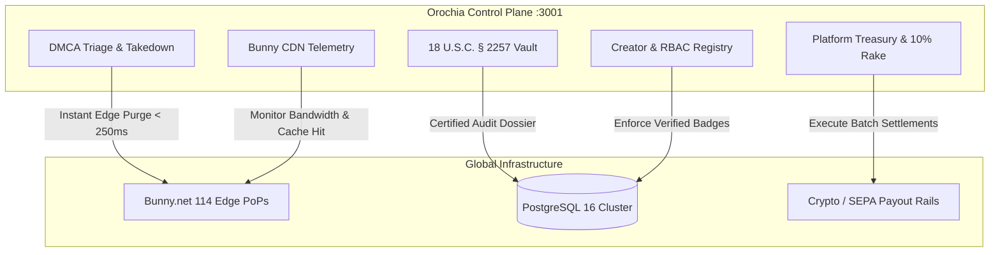

<div align="center">

# 🛡️ OROCHIA CONTROL PLANE
### Operations, Compliance Vault & Multi-Stream Treasury Console

[](https://github.com/krizaka/orochia-admin/actions/workflows/ci.yml)
[](LICENSE)
[](https://nextjs.org/)
[](http://localhost:3001)

The dedicated control plane and federal compliance vault for [**Orochia**](https://github.com/krizaka/orochia), engineered by **Krizaka**.

[Consumer App](https://github.com/krizaka/orochia) • [Design System](https://github.com/krizaka/orochia-design-system) • [Architecture Guide](AGENTS.md)

</div>

---

## 🌟 Capabilities & Administrative Workflows



### 1. 18 U.S.C. § 2257 Performer Compliance Vault
- Primary producer government identification records (passports, driver's licenses).
- Records custodian physical addresses & date of birth certifications.
- One-click certified federal audit dossier export (`CSV` / `JSON`) formatted for U.S. Department of Justice compliance standards.

### 2. Emergency CDN Purge & DMCA Triage
- Triage copyright claims and performer removal notices.
- **Single-Click Global Bunny CDN Purge**: Executes worldwide cache invalidation and token revocation in `< 250ms`, returning `403 Forbidden` across all 114 edge PoPs.

### 3. Treasury & 4-Tier Platform Monetization
- **10% Protocol Take Rate**: Continuous rake deducted from tips, pay-per-view unlocks, and fan memberships.
- **$49 Performer Audit Fee**: One-time federal record onboarding fee charged per producer.
- **Sanctuary Spotlight**: Daily auction bidding for featured creator placement on the consumer homepage ($25/day).
- **1.5% Fast-Lane Payout Fee**: Express processing fee for instant crypto (USDC / USDT) and SEPA settlements.
- One-click batch payout settlement processor.

### 4. Bunny.net Stream Telemetry
- Global Anycast PoP latency table (Frankfurt, Ashburn, London, Singapore, Tokyo, São Paulo).
- Video library storage zone distribution (680 GB active replicated).
- Transcoding queue & cache hit metrics (98.6% average hit ratio).

---

## 🚀 Quickstart

```bash
# 1. Clone repository
git clone https://github.com/krizaka/orochia-admin.git
cd orochia-admin

# 2. Install dependencies
npm install

# 3. Launch Admin Dev Server on port 3001
npm run dev -- -p 3001
```

Access the dashboard at [http://localhost:3001](http://localhost:3001).

### Default Local Credentials
- **Root Admin**: `admin@orochia.org` / `admin1234`
