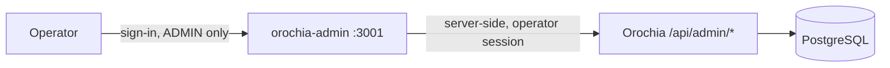

<div align="center">

# 🛡️ OROCHIA CONTROL PLANE
### Operations, Compliance Vault & Multi-Stream Treasury Console

[](https://github.com/krizaka/orochia-admin/actions/workflows/ci.yml)
[](LICENSE)
[](https://nextjs.org/)
[](http://localhost:3001)

The dedicated control plane and federal compliance vault for [**Orochia**](https://github.com/krizaka/orochia), engineered by **Krizaka**.

[Consumer App](https://github.com/krizaka/orochia) • [Design System](https://github.com/krizaka/orochia-design-system) • [Architecture Guide](AGENTS.md)

</div>

---

## What it does

| Screen | Backed by | Purpose |
| :--- | :--- | :--- |
| Overview | `GET /api/admin/overview` | Ledger totals, catalogue state and the three queues that need a human |
| 2257 Creator Verification | `GET/PATCH /api/admin/creators` | Approve a creator after their identity and age records are checked — only verified creators can upload |
| Content Reports | `GET/PATCH /api/admin/reports` | Triage reports; suspected minors and non-consensual content first |
| Treasury & Payouts | `GET /api/platform/treasury`, `GET/PATCH /api/admin/payouts` | Revenue from the ledger; settle (with transfer reference) or fail (with reason, refunds the balance) payouts |
| Catalogue | `GET /api/bunny/analytics` | Videos by encoding state, total views |
| Creator Registry | `GET/PATCH /api/admin/creators` | All creators, activity, suspend/restore uploads |



## Run locally

```bash
cp .env.example .env.local      # OROCHIA_API_URL=http://localhost:3000
npm install
npm run dev                     # http://localhost:3001 — sign in with an Orochia ADMIN account
```

Start [Orochia](https://github.com/krizaka/orochia) first (`npm run dev` there; the seed creates an
administrator for local use).

## Deploy

`deploy/Dockerfile` builds a standalone image (port 3001). Set `OROCHIA_API_URL` (internal URL of the
Orochia web service) and `NEXT_PUBLIC_OROCHIA_APP_URL`. Expose the console only on a private network or
behind an IP allow-list.

## License

Apache License 2.0 — see [LICENSE](LICENSE).
