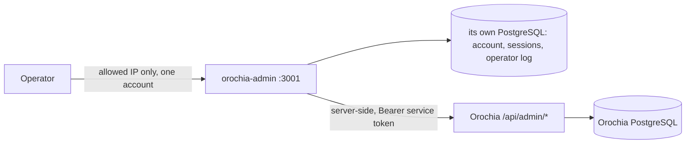

<!-- krizaka-header -->
<div align="center">


# Orochia Admin

**Creators get paid. Every cent, exactly once.**

The operator console of Orochia: 18 U.S.C. § 2257 creator verification, content-report triage, catalogue, auctions, treasury and payouts, backups — a server-side BFF over the Orochia admin API, with one operator account and its own database.

[](https://github.com/krizaka/orochia-admin/actions/workflows/ci.yml)
[](LICENSE)
[](https://www.krizaka.com/en/products/orochia#guarantees)
[](https://www.krizaka.com/en/products/orochia/docs/getting_started)

[Documentation](https://www.krizaka.com/en/products/orochia/docs/getting_started) · [Website](https://www.krizaka.com) · [Krizaka on GitHub](https://github.com/krizaka)

</div>
<!-- /krizaka-header -->

---

## What it does

| Screen | Backed by | Purpose |
| :--- | :--- | :--- |
| Overview | `GET /api/admin/overview` | Ledger totals, catalogue state and the three queues that need a human |
| 2257 Creator Verification | `GET/PATCH /api/admin/creators` | Approve a creator after their identity and age records are checked — only verified creators can upload |
| Content Reports | `GET/PATCH /api/admin/reports` | Triage reports; suspected minors and non-consensual content first |
| Treasury & Payouts | `GET /api/platform/treasury`, `GET/PATCH /api/admin/payouts` | Revenue from the ledger; settle (with transfer reference) or fail (with reason, refunds the balance) payouts |
| Catalogue | `GET /api/bunny/analytics` | Videos by encoding state, total views |
| Creator Registry | `GET/PATCH /api/admin/creators` | All creators, activity, suspend/restore uploads |

| Auctions | `GET/DELETE /api/admin/auctions` | Open, awaiting and sold auctions, credits held; cancel with a reason |
| Platform & Database | `/api/admin/platform*` + the console's own log | Migration history, rows per table, backups, factory reset (development), operator log |



## Run locally

```bash
cp .env.example .env.local      # its database, the operator account, the token shared with Orochia
npm install
npm run dev                     # http://localhost:3001 — sign in with ADMIN_EMAIL / ADMIN_PASSWORD
```

Start [Orochia](https://github.com/krizaka/orochia) first, with the same `OROCHIA_ADMIN_API_TOKEN` in its `.env`.
Create the console's database once:
`docker exec orochia-postgres-dev psql -U orochia_user -d orochia_db -c "CREATE DATABASE orochia_admin"`.

## Deploy

`deploy/Dockerfile` builds a standalone image (port 3001); `deploy/app-spec.dev.yaml` creates the App Platform app in
the `orochia` project with its own dev database. Secrets (`ADMIN_PASSWORD`, `OROCHIA_ADMIN_API_TOKEN`) are app
variables, never in git. `ADMIN_ALLOWED_IPS` lists the only addresses that reach the console.

## License

Apache License 2.0 — see [LICENSE](LICENSE).
